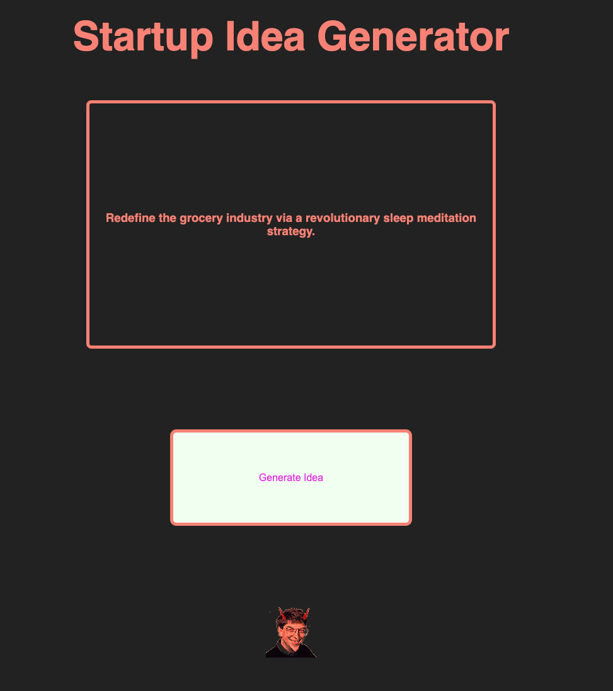
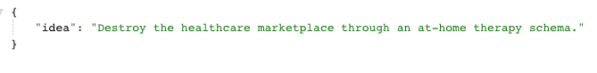

# startup-generator-api

## Intro
---
The <strong> Startup Idea Generator </strong> helps you find your next thousand dollar tech startup idea in seconds! 

## Screenshots
---

 <strong>App and API</strong> 

  
<strong> Web Page </strong>

  
<strong> API </strong>

  

## Technologies Used
---
- Node
- Express
- HTML
- CSS
- Vanilla Javascript
- Fetch / AJAX

## Getting Started  
---
Check out [The Startup Idea Generator][1]! Easy UI for instantly generating ideas.
  
Incorporate into your project:  
- Feel free to consume the Startup Idea Generator data via this [endpoint][2].

   

## Next Steps  
---
Conquer the world, then go to space.

[1]: https://cool-startup-generator.herokuapp.com/
[2]: https://cool-startup-generator.herokuapp.com/api/random
